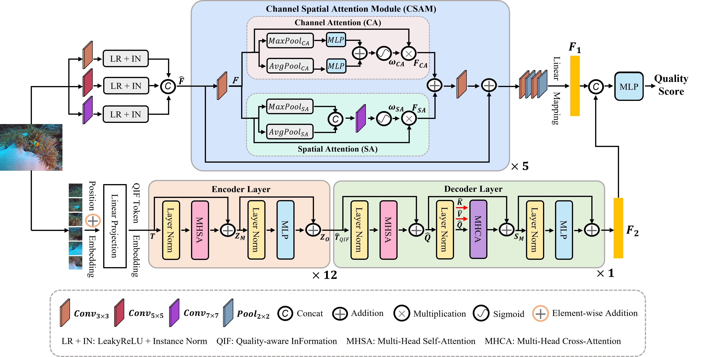

# ATUIQPv2

Mainly added 'deit_3_small_224_1k.pth' weights for encoder layer of ATUIQP.

## Underwater Image Quality Assessment: Benchmark Database and Objective Method

📚[Paper](https://ieeexplore.ieee.org/document/10452874)

### Architecture of ATUIQPv2

<picture>
  
</picture>

### Test prediction code of ATUIQPv2
You can download 'model_epoch_10.pth' and 'deit_3_small_224_1k.pth' from [Baidu Netdisk](https://pan.baidu.com/s/1sGj9S42AzV8-fFdM1HibLg?pwd=7777).

### Citation

🌟 If you find our work helpful, please leave us a star and cite our paper.

BibTeX
```
@article{liu2024underwater,
  title={Underwater Image Quality Assessment: Benchmark Database and Objective Method},
  author={Liu, Yutao and Zhang, Baochao and Hu, Runze and Gu, Ke and Zhai, Guangtao and Dong, Junyu},
  journal={IEEE Transactions on Multimedia}, 
  year={2024},
  volume={26},
  pages={7734-7747},
  doi={10.1109/TMM.2024.3371218}
}
```

GB/T 7714
```
Liu Y, Zhang B, Hu R, et al. Underwater image quality assessment: Benchmark database and objective method[J]. IEEE Transactions on Multimedia, 2024, 26: 7734-7747.
```
